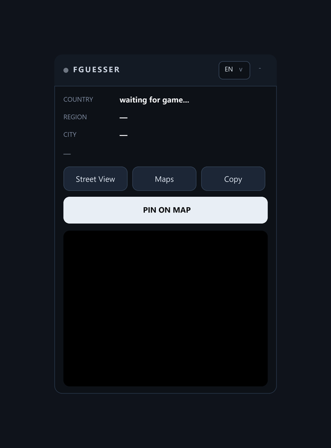

# FGUESSER

FGUESSER es un map cheat para GeoGuessr y OpenGuessr que revela la ubicación real de cada ronda y marca un pin directo en el mapa.

  

**Idioma:** [Português](README.pt.md) • [English](README.md) • Español (este archivo)

## Qué hace

- Revela las coordenadas reales del Street View actual
- Muestra país, región y ciudad con bandera
- Marca un pin rojo en el mapa en el punto exacto
- Vista previa del mapa OpenStreetMap con la ubicación real
- Interfaz en Português, English y Español
- Funciona en [GeoGuessr](https://www.geoguessr.com) (Classic, Streaks, Duels, Party) y en [OpenGuessr](https://openguessr.com) (gratis, rondas ilimitadas)

## Instalación

1. Instala [Tampermonkey](https://www.tampermonkey.net/)
2. Crea un nuevo userscript
3. Pega el contenido completo de `FGUESSER.user.js`
4. Guarda con `Ctrl+S` y recarga GeoGuessr u OpenGuessr

## Cómo usar

1. Entra a cualquier partida en GeoGuessr u OpenGuessr (OpenGuessr es gratis con rondas ilimitadas)
2. Espera el punto verde — la ubicación real aparece en el panel
3. Haz clic en `PIN ON MAP` o pulsa `6` y el pin cae en el punto exacto
4. Confirma tu respuesta en el juego y recoge los 5000
5. Pulsa `1` para ocultar / mostrar el panel

## Atajos

| Tecla | Acción |
|-------|--------|
| `1` | Ocultar / mostrar panel |
| `6` | Marcar pin en el mapa |

## Archivos

| Archivo | Descripción |
|---------|-------------|
| `FGUESSER.user.js` | Userscript de Tampermonkey, instala este |
| `preview-v1.png` | Vista previa del panel |

## Releases

| Versión | Descripción |
|---------|-------------|
| [v1.0](https://github.com/foltzbr/FGUESSER/releases/tag/v1.0) | Autopin con pin rápido, EN / PT / ES — GeoGuessr y OpenGuessr |

Descarga el archivo listo en la [página de releases](https://github.com/foltzbr/FGUESSER/releases).
