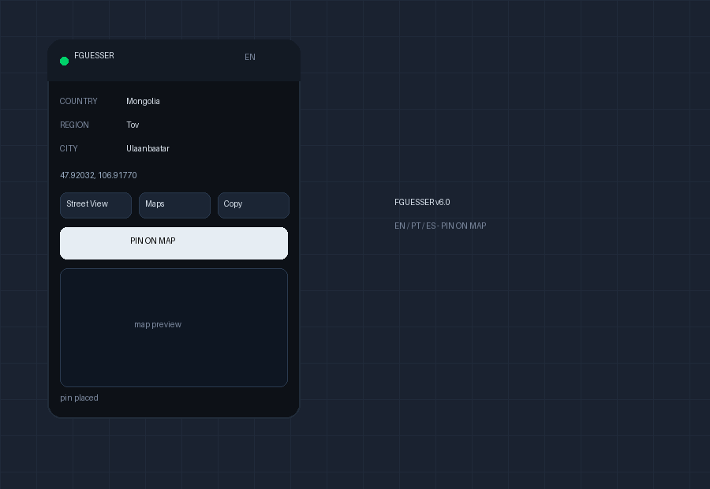

# ⚡ FGUESSER

Clean GeoGuessr companion panel with real location display and fast map pin.

  

## Features

- Real-time location detection via Street View metadata
- Country / Region / City with flag
- Embedded OpenStreetMap preview
- Fast map pin with 60fps tracking, stays glued while panning and zooming
- Multi-language UI: English (default), Português, Español
- One-click Street View, Maps and Copy
- Works in Classic, Streaks, Duels and Party

## Install

1. Install [Tampermonkey](https://www.tampermonkey.net/)
2. Create a new userscript
3. Paste the full content of `FGUESSER.user.js`
4. Save with `Ctrl+S` and reload GeoGuessr

## Usage

1. Join any game
2. Wait for the green dot + location info
3. Click `PIN ON MAP` or press `6` to place the pin on the in-game map
4. Press `1` to hide / show the panel
5. Switch language anytime via the EN / PT / ES selector

## Shortcuts

| Key | Action |
|-----|--------|
| `1` | Hide / show panel |
| `6` | Place pin on map |

## Files

| File | Description |
|------|-------------|
| `FGUESSER.user.js` | Tampermonkey userscript |
| `preview.png` | Panel preview |

## Changelog

### 6.0
- Multi-language support (EN default, PT, ES)
- Faster pin rendering with requestAnimationFrame
- Improved map instance lookup, less drift on scroll and zoom
- Renamed action button to `PIN ON MAP`
- Removed auto mode for maximum stability across all game modes
